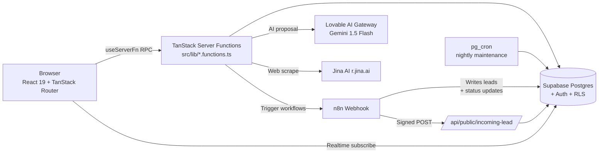

# Architecture

## Request flow: "Generate proposal"

1. User clicks *Generate Pro Proposal* on a lead row.
2. `useServerFn(requestProposalFn)` sends an RPC with the bearer token
   attached by `attachSupabaseAuth`.
3. `requestProposalFn` runs `assertWithinDailyLimit(userId)` against
   `user_limits`; throws `LIMIT_EXCEEDED` if capped.
4. It calls the Lovable AI Gateway with a portfolio-aware system prompt.
5. Result is written to `leads.business_proposal` via `supabaseAdmin` (RLS
   would prevent cross-user writes; the handler already checked ownership).
6. n8n is notified via `dispatchToN8n({ action: 'generate_proposal', ... })`.
7. Realtime channel updates the dashboard row without a full refetch.

## Route boundaries

- **Public routes** — `/`, `/auth`, `/api/public/*`. SSR on, no auth gate.
- **Authenticated routes** — everything under `src/routes/_authenticated/`.
  The pathless layout enforces sign-in client-side (`ssr: false`).
- **Admin room** — `src/routes/_authenticated/admin.tsx` — additionally
  checks `has_role(auth.uid(),'admin')` inside its loader server function.

## Key server functions

| Function                    | File                            | Purpose                                |
|-----------------------------|---------------------------------|----------------------------------------|
| `listLeadsFn`               | `dashboard.functions.ts`        | Owner-scoped leads list                |
| `requestProposalFn`         | `dashboard.functions.ts`        | AI proposal + n8n dispatch             |
| `validateContactFn`         | `dashboard.functions.ts`        | Server-side DNS MX validation          |
| `updateLeadTagsFn`          | `dashboard.functions.ts`        | Replace tag list                       |
| `bulkUpdateLeadsFn`         | `dashboard.functions.ts`        | Multi-row status/tag update            |
| `runScraperFn`              | `scraper.server.ts` (wrapped)   | Portfolio-driven multi-query scrape    |
| `marketingChatFn`           | `marketing-chat.functions.ts`   | AI coach with plan + audit context     |
