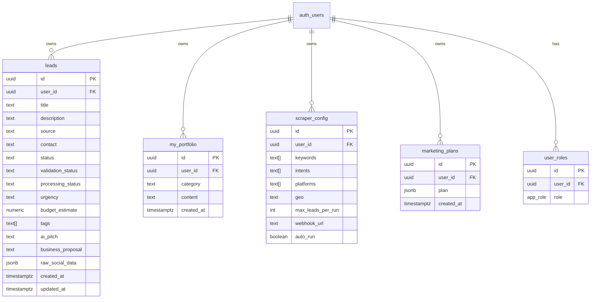

# Data Model

All tables live in `public`. RLS is enabled on every table. `service_role`
retains `ALL`; per-role grants below are the exact minimum required.

## RLS summary

| Table            | anon | authenticated                                   |
|------------------|------|-------------------------------------------------|
| `leads`          | —    | SELECT/INSERT/UPDATE/DELETE where `user_id = auth.uid()` |
| `my_portfolio`   | —    | SELECT/INSERT/UPDATE/DELETE where `user_id = auth.uid()` |
| `scraper_config` | —    | SELECT/INSERT/UPDATE/DELETE where `user_id = auth.uid()` |
| `marketing_plans`| —    | SELECT/INSERT/UPDATE/DELETE where `user_id = auth.uid()` |
| `user_roles`     | —    | SELECT own row only. Role writes via `service_role`.     |

## Indexes

- `idx_leads_user_status_created` — `(user_id, status, created_at DESC)`
- `idx_leads_user_created` — `(user_id, created_at DESC)`
- `leads.tags` — GIN

## Triggers

- `trg_leads_updated_at` → `set_updated_at()` refreshes `leads.updated_at`.
- `on_auth_user_created` → `handle_new_user_role()` grants `user` (and `admin`
  for the owner email) on signup.

## Scheduled jobs (pg_cron)

- `nightly-leads-maintenance` — daily 03:15 UTC —
  `purge_stale_ignored_leads()` + `ANALYZE public.leads`.
